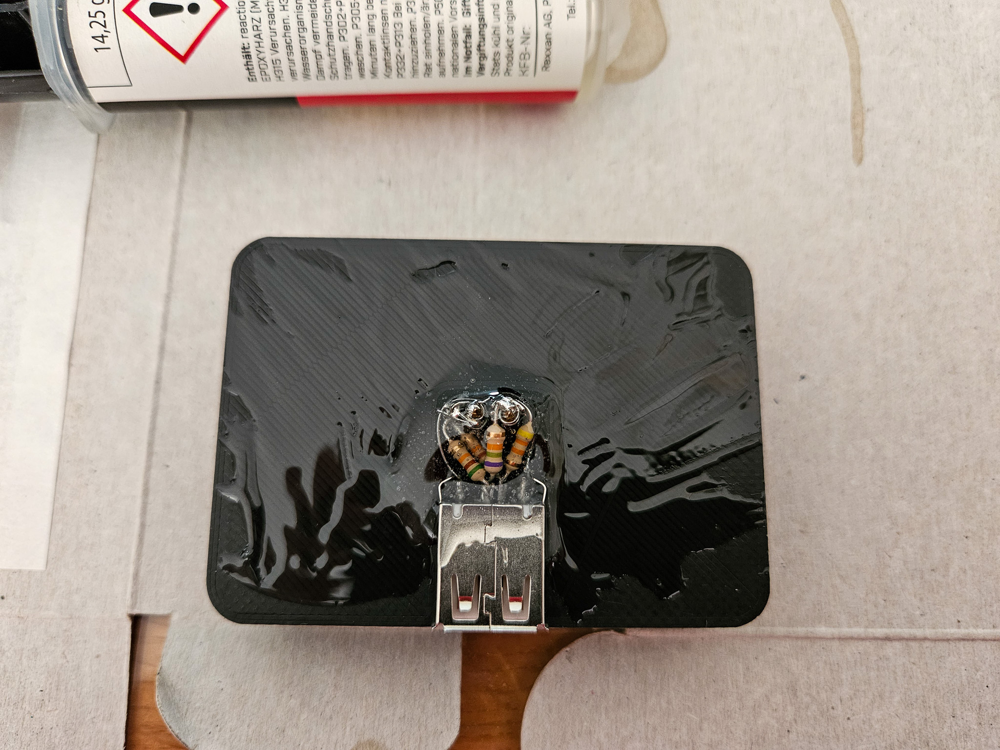

# Going for a second edition (with USB-A Socket)

Its the time of the year again. The weather gets warmer and the next trips on the bike 🏍️ are getting closer. [The adaptor from last year](https://kateiren.github.io/tomtom-rider-adapter/) didn't hold to its promises. My phone ran out of battery while driving more than once.
I wasn't able to get the power out of the charger to keep the deivce juiced up during navigation.

Thats why I started tinkering on the adaptor again. Last time I wasn't 100% following the instructions as the required resistors were out of the usual to be found steps in my resistor library. Combining some ordinary resistors in a way to get to the same voltage divider was not possible due to the lack of space in the design. 

This time I was ordering exactle whats needed plus a USB A socket to stay flexible with the cabling.

So modifying the 3D model again and a few tests later assembling could start.

## Putting it together

{: width="500" }

{: width="500" }

{: width="500" }

{: width="500" }

{: width="500" }

{: width="500" }

## Result

Measurements done on the laboratory power supply show that my Galaxy S21 draws around 1A from the socket when connected to 5V.

Hooked up with the bike, the phone tells me at 58% that it needs 1 hour and 1 minute until fully charged. Let's see if that gives enough juice when the display, LTE and GPS is switched on...

{: width="500" }
